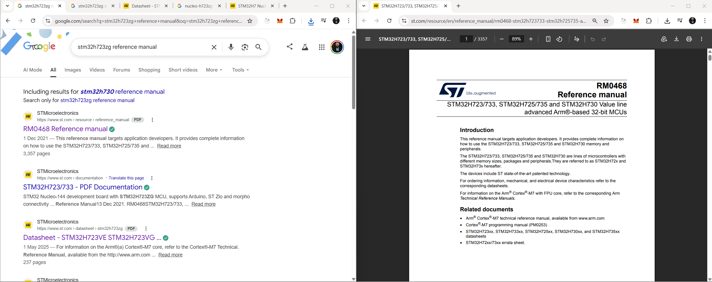
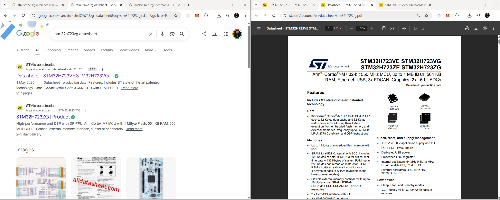
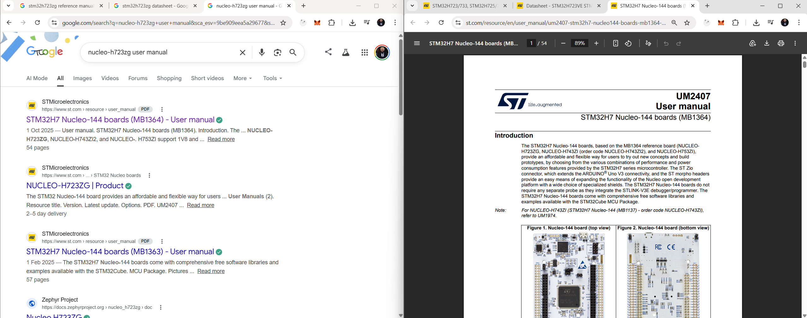
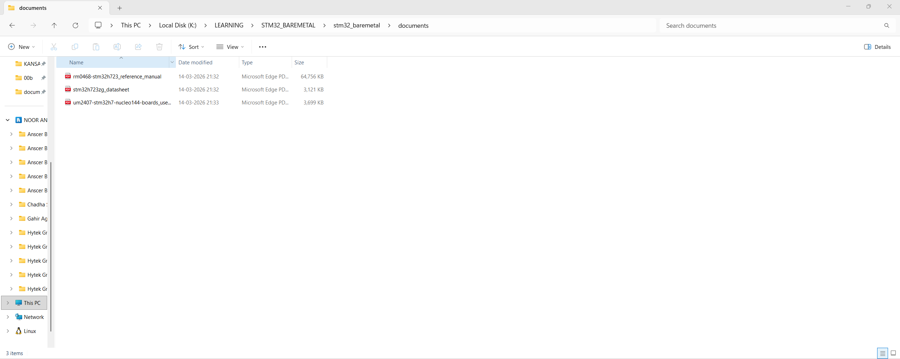

# Required Documents for Bare-Metal STM32 Development

Before writing any bare-metal code, you need the official documentation for your MCU and board. This guide uses the **Nucleo STM32H723ZG** as an example; adjust the part numbers if you use a different STM32 or board.

---

## Why You Need These Three Documents

| Document | Purpose |
|----------|---------|
| **Reference Manual** | Describes the MCU’s internal peripherals (registers, clocks, GPIO, timers, etc.). You use it to know which registers to read/write and how to configure the chip. |
| **Datasheet** | Describes electrical specs, pinout, package, and part variants. You use it to choose the correct pins and understand voltage/current limits. |
| **Nucleo User Manual** | Describes the Nucleo board: which MCU pins are connected to LEDs, buttons, headers, and connectors. You use it to map “board feature” to “MCU pin” when writing code. |

Without these, you would be guessing register addresses and pin connections; with them, you can write correct, maintainable bare-metal code.

---

## Step 1: Download the Reference Manual

1. Search for **“STM32H723ZG reference manual”** (or your exact part number + “reference manual”) in your browser.
2. Open the official STMicroelectronics page (usually **www.st.com** or **www.st.com/resource/en/reference_manual/...**).
3. Download the PDF (e.g. **RM0468 – STM32H723/725 reference manual**).

---

## Step 2: Download the Datasheet

1. Search for **“STM32H723ZG datasheet”** (or your MCU part number + “datasheet”).
2. Open the official ST page for the product.
3. Download the PDF (e.g. **STM32H723ZG datasheet**).

---

## Step 3: Download the Nucleo User Manual (Nucleo Boards Only)

If you are using a Nucleo board:

1. Search for **“Nucleo-H723ZG user manual”** (or your board name + “user manual”).
2. Open the official ST page (e.g. **UM2407 – STM32H7 Nucleo-144 boards**).
3. Download the PDF.

This manual shows how GPIO and peripherals are wired on the board (e.g. which pin drives the user LED), so you can match your code to the hardware.

---

## Organizing Your Documents

Keep all three PDFs in one folder (e.g. `documents/`) so you can open them quickly while coding. You can rename the files for clarity, for example:

- `rm0468-stm32h723_reference_manual.pdf`
- `stm32h723zg_datasheet.pdf`
- `um2407-stm32h7-nucleo144-boards_user_manual.pdf`

Once these are in place, you’re ready to set up your project in STM32CubeIDE — see **[00b_stm32cubeide_setup.md](00b_stm32cubeide_setup.md)** for the next steps.
