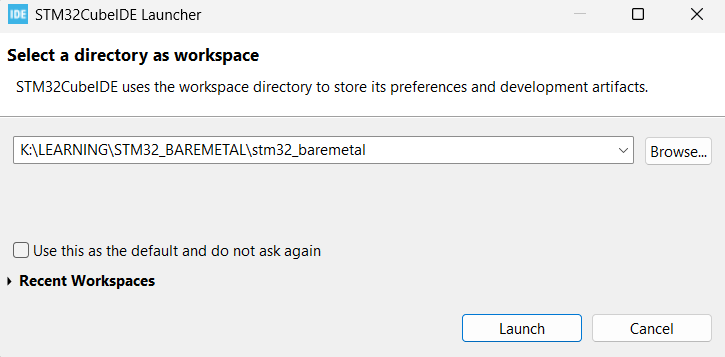
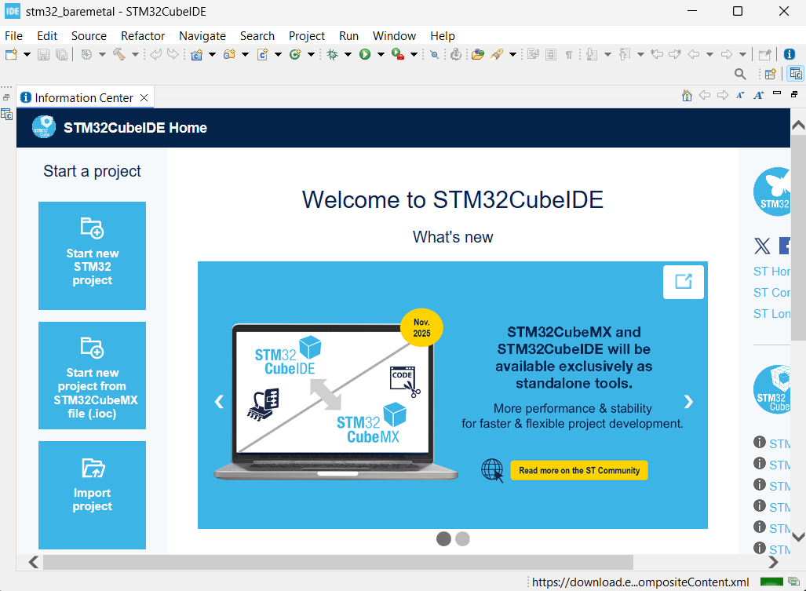
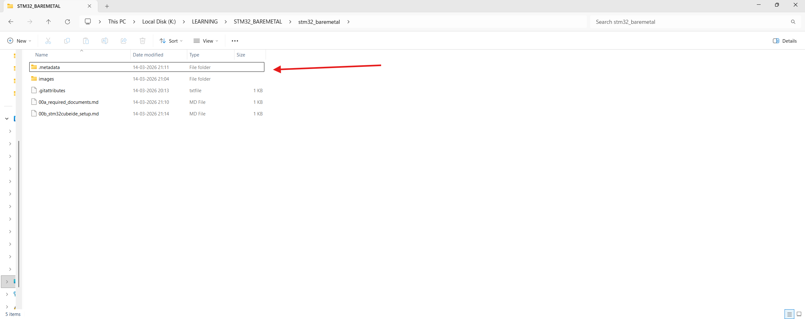
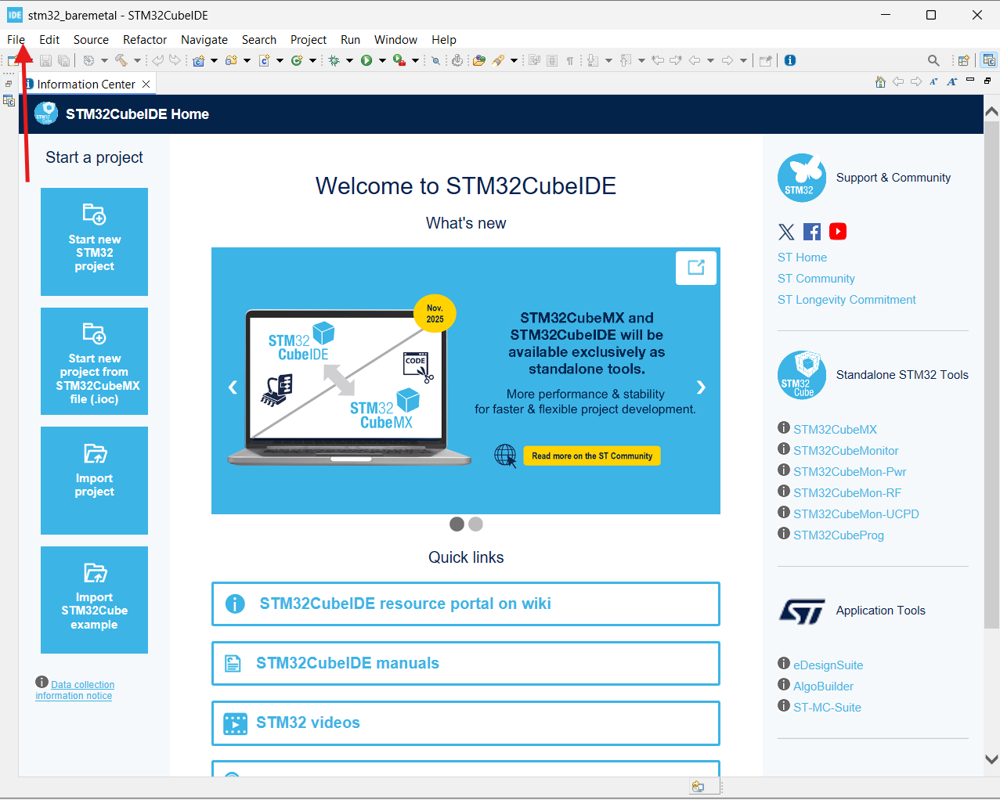
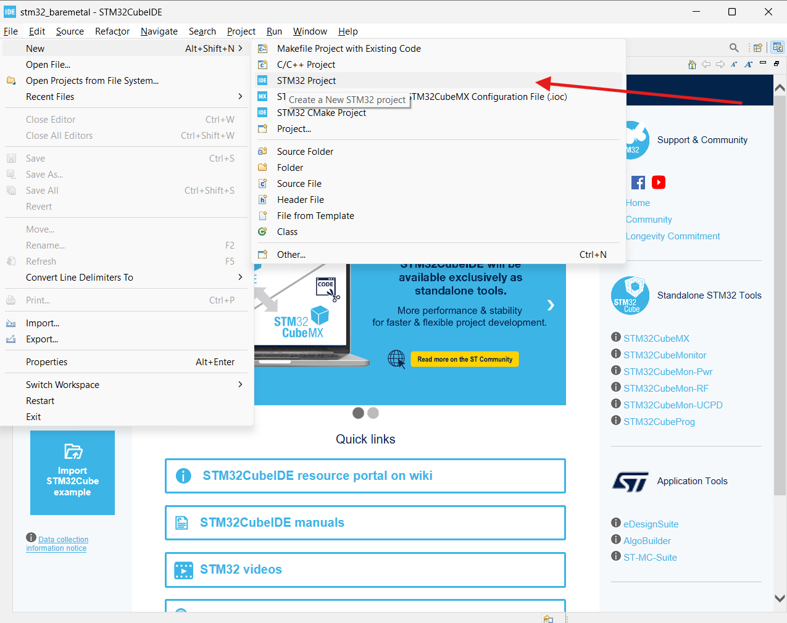
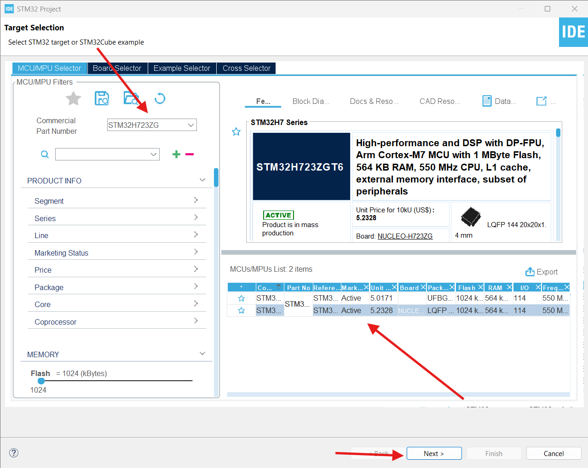
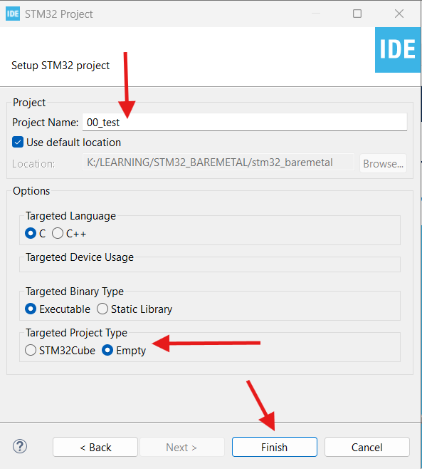
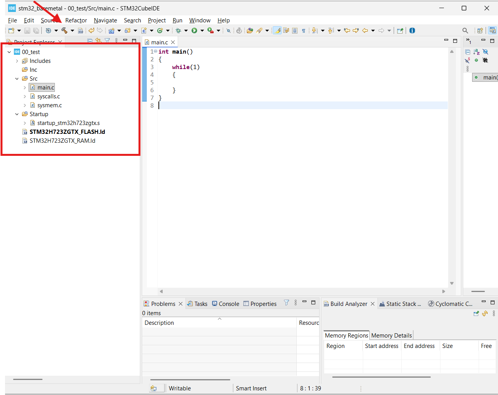
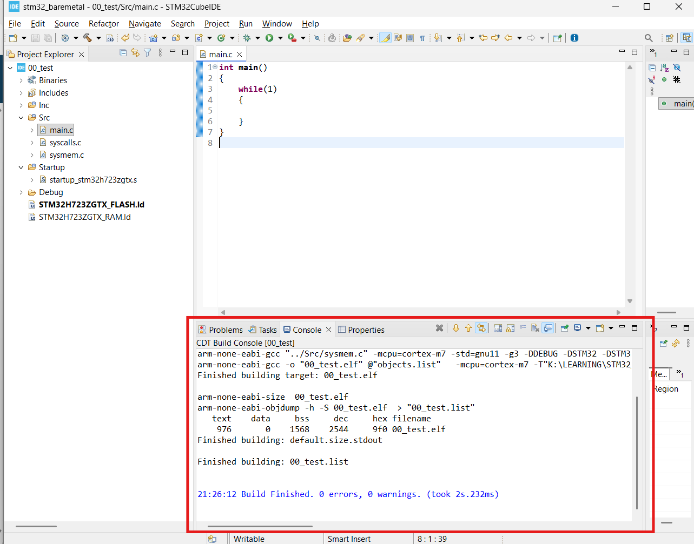

# STM32CubeIDE Project Setup — Bare-Metal “Hello World”

This guide walks you through creating a minimal bare-metal project in STM32CubeIDE and verifying the toolchain with a successful build. You should have the required documents from **[00a_required_documents.md](00a_required_documents.md)** before starting.

---

## Step 1: Launch STM32CubeIDE and Choose a Workspace

1. Open **STM32CubeIDE**.
2. When prompted, choose or create a **workspace** folder. This is where all your projects and IDE metadata will live (e.g. `K:\LEARNING\STM32_BAREMETAL\stm32_baremetal` or a dedicated `STM32_Workspace`).
3. Optionally enable **“Use this as the default and do not ask again”** if you want to always use this location.



---

## Step 2: IDE Welcome / Workbench

After the workspace is set, the IDE opens. You may see a welcome screen with links to tutorials and resources. Close or minimize it to get to the main workbench (Project Explorer, editor, etc.).



---

## Step 3: Workspace Folder and `.metadata`

The folder you chose as the workspace will contain a **`.metadata`** directory. STM32CubeIDE uses it to store project settings, build configs, and UI state. Do not delete it if you want to keep your workspace intact.



---

## Step 4: Create a New Project

Use **File → New → STM32 Project** (or the equivalent in your IDE version). The **MCU/Board Selector** will open so you can pick your target device or board.



---

## Step 5: Select Your MCU or Board

- Either search for your part (e.g. **STM32H723ZGTx**) and select it, or  
- Choose your Nucleo board (e.g. **Nucleo-H723ZG**) so the correct MCU and default pins are set.

Confirm and click **Next** to continue the project wizard.



---

## Step 6: Project Name and Location

Give your project a name (e.g. **00_test**) and leave the default location under the workspace unless you need a different path. Click **Finish** to create the project.



---

## Step 7: Project Created

STM32CubeIDE will generate the project with startup code, linker script, and a default `main.c`. You should see the project in **Project Explorer** with folders such as **Src**, **Inc**, **Startup**, etc. (exact names depend on your CubeIDE / project template version).



---

## Step 8: Minimal Bare-Metal `main.c` and Build

We will replace the generated `main.c` with a minimal bare-metal entry point and then build to confirm the toolchain works.

1. In **Project Explorer**, open **`main.c`** under your source folder (often **Src** or **Core/Src**).
2. **Delete all existing code** in `main.c`.
3. Replace it with exactly this:

```c
int main(void)
{
    while (1)
    {
    }
}
```

4. Save the file (**Ctrl+S**).
5. Build the project: **Project → Build Project** (or **Ctrl+B**).



---

## Step 9: Verify a Successful Build

After the build finishes, check the **Console** at the bottom of the IDE. You should see a message like **“Build Finished. 0 errors, 0 warnings.”** and the output ELF (e.g. `00_test.elf`) in the **Debug** (or **Release**) folder.



If the build succeeds, your STM32CubeIDE setup and toolchain are correct. Next, add CMSIS chip headers and point the compiler at them — see **[00c_chip_headers.md](00c_chip_headers.md)**.
