# 00c — Chip headers (CMSIS for STM32H7)

This chapter explains how to bring **ST’s CMSIS device headers** for STM32H7 into your bare-metal project: download **STM32CubeH7**, lay out a **`chip_headers`** folder, point STM32CubeIDE at the headers, then select your exact H7 part so **`stm32h7xx.h`** compiles.

You should already have a working project from **[00b_stm32cubeide_setup.md](00b_stm32cubeide_setup.md)**.

The **figures below follow your saved screenshots** `1.png` … `12.png` in **`images/00c/`** in order — no need to rename image files.

---

## Why this step exists

`stm32h7xx.h` is a **family** header. The compiler must know **which device line** you use (for Nucleo-H723ZG that is **STM32H723** → macro **`STM32H723xx`**). After the headers and include paths are in place, you define that macro (or uncomment the matching line in `stm32h7xx.h`) so the build succeeds.

---

## Part A — Download STM32CubeH7 from ST

### Step 1 — Open ST’s website

1. In your browser, open **[https://www.st.com](https://www.st.com)**.

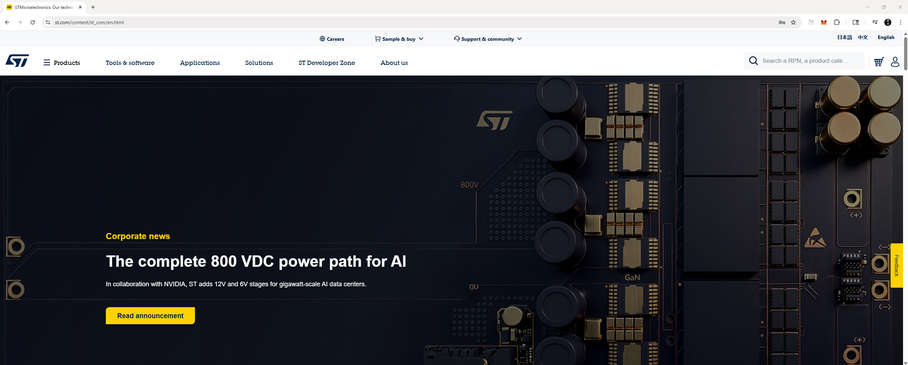

### Step 2 — Search for STM32CubeH7

1. Use the site navigation or search to reach **STM32 embedded software** (or equivalent **Tools & software** area).
2. Search for **`stm32cube h7`**.
3. In the results, locate **STM32CubeH7** (MCU package for STM32H7, includes **CMSIS**).

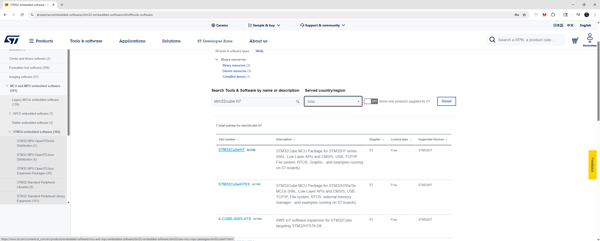

### Step 3 — Open the STM32CubeH7 product page

1. Open the **STM32CubeH7** product / download page.
2. Use **Get latest** (or **Get from GitHub**) for the main **STM32CubeH7** package. Note the version (e.g. **1.13.0**); newer versions work the same way.

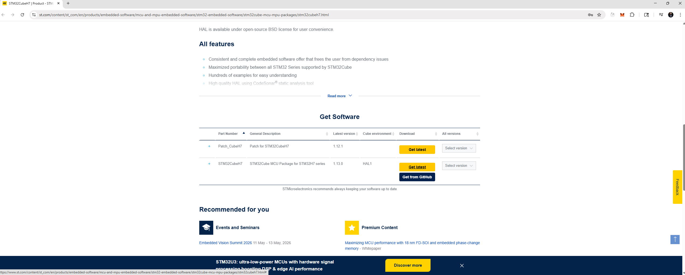

### Step 4 — Accept the license and download

1. If a **License Agreement** dialog appears, read it, then click **Accept** to start the download.
2. When the **.zip** finishes, extract it (e.g. to `Downloads` or `K:\...\stm32cubeh7-v1-x-x`). Inside you will use **`STM32Cube_FW_H7_Vx.x.x\Drivers\CMSIS`** in the next part.

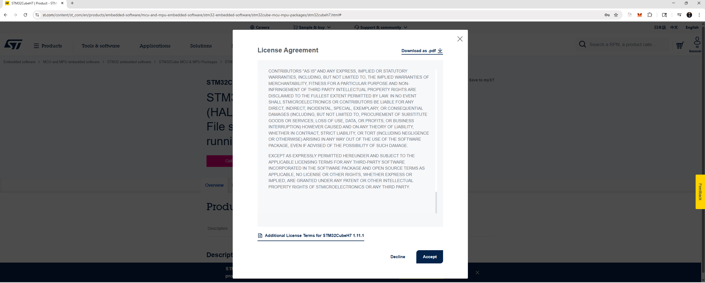

---

## Part B — Create `chip_headers` and copy CMSIS folders

Use the folder name **`chip_headers`** (underscore). The screenshots show copying from the extracted firmware tree **`...\Drivers\CMSIS`**.

### Step 5 — `chip_headers` at the repository root

1. At the **repository root** (same level as **`00_test`**, **`docs`**, **`images`**, …), create a folder **`chip_headers`** if it is not there yet.
2. This copy is useful as a **staging** area; you will also use **`chip_headers`** inside **`00_test`** for the compiler paths used in class.

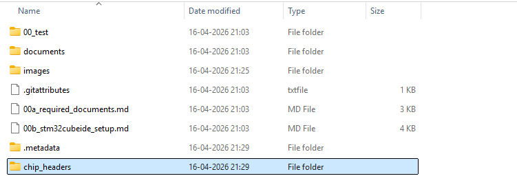

### Step 6 — Copy **`Include`** from the pack into **`chip_headers`**

1. Open the extracted firmware: **`STM32Cube_FW_H7_Vx.x.x\Drivers\CMSIS`**.
2. Copy the **`Include`** folder into **`K:\Learning\stm32_baremetal\chip_headers`** (adjust drive/path to your machine).

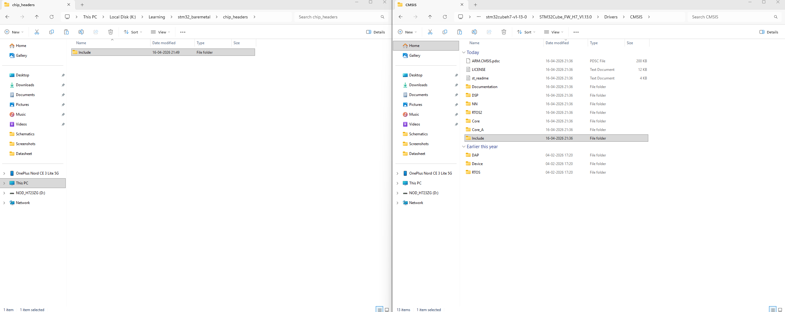

### Step 7 — Copy **`Device`** as well

1. From the same **`Drivers\CMSIS`** folder, copy **`Device`** into **`chip_headers`** so you have both **`chip_headers\Include`** and **`chip_headers\Device`**.

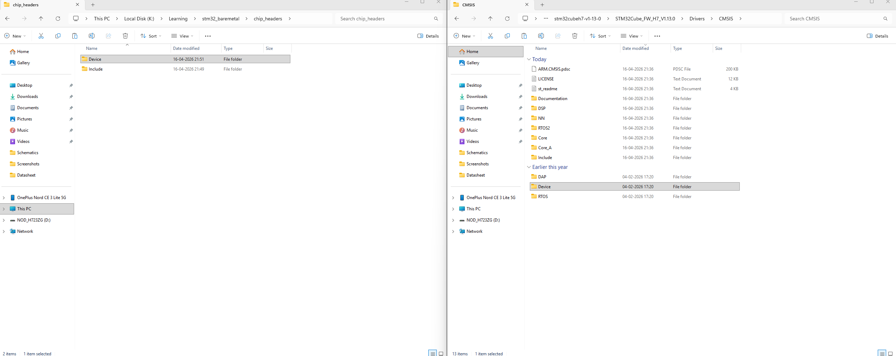

### Step 8 — Trim **`STM32H7xx`** under Device

1. Open **`chip_headers\Device\ST\STM32H7xx`**.
2. Remove extra content until you only keep:
   - **`Include`** — device headers (`stm32h7xx.h`, `stm32h723xx.h`, …).
   - **`Source`** — template sources (e.g. **`system_stm32h7xx.c`**) if you want them for later; delete unrelated examples or duplicate trees you do not need.

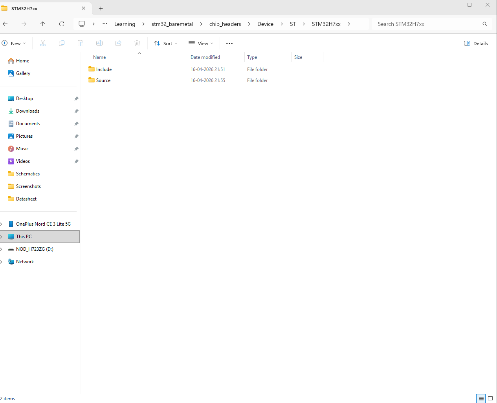

### Step 9 — Put **`chip_headers`** inside the **`00_test`** project

1. Copy the whole **`chip_headers`** folder into **`00_test`** (next to **`Src`**, **`Startup`**, linker scripts, etc.) so the project owns the headers you will include from CubeIDE.

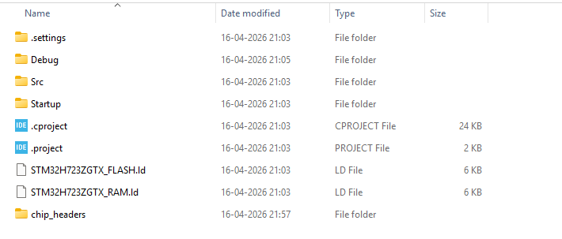

**Folder layout vs include paths (read once):**  
Figures **6–9** use **`00_test\chip_headers\Include`** and **`00_test\chip_headers\Device\ST\STM32H7xx\...`**.  
Figure **12** shows an include path with an extra **`CMSIS`** segment: **`...\00_test\chip_headers\CMSIS\Include`**. That only works if **`Include`** (and **`Device`**) actually live under **`00_test\chip_headers\CMSIS\`**. You can either:

- Create **`00_test\chip_headers\CMSIS`** and move **`Include`** and **`Device`** inside it (mirror ST’s **`Drivers\CMSIS`** layout), **or**
- Keep the flat layout from figures **7–9** and in CubeIDE use **`...\00_test\chip_headers\Include`** and **`...\00_test\chip_headers\Device\ST\STM32H7xx\Include`** instead of **`...\CMSIS\...`**.

Pick **one** layout and make the two **Paths and Symbols** entries point at the real folders on disk.

---

## Part C — Point STM32CubeIDE at the headers

### Step 10 — Open **Properties**

1. In **Project Explorer**, select project **`00_test`**.
2. Use **Project → Properties** (or right-click the project → **Properties**).

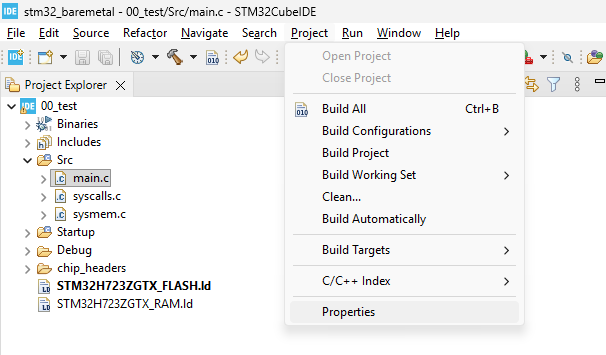

### Step 11 — **Paths and Symbols** → **Includes** (GNU C)

1. In the left tree: **C/C++ General** → **Paths and Symbols**.
2. Open the **Includes** tab, choose **GNU C**, configuration **Debug** (or **All configurations** if you prefer).
3. You should see at least the project **`Inc`** entry before you add CMSIS paths.

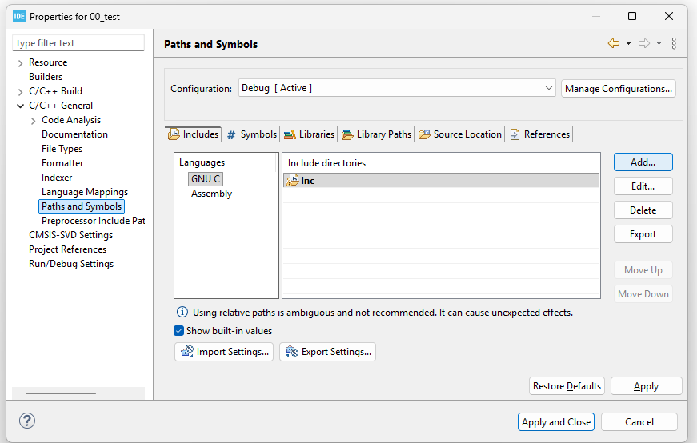

### Step 12 — Add the first include directory (then add the second)

1. Click **Add…** and add the **ARM CMSIS core** headers directory, for example:
   - **`K:\Learning\stm32_baremetal\00_test\chip_headers\CMSIS\Include`**  
     (only if you used the **`CMSIS`** subfolder layout — see the note under Step 9), **or**
   - **`K:\Learning\stm32_baremetal\00_test\chip_headers\Include`**  
     if **`Include`** sits directly under **`chip_headers`**.
2. Click **Add…** again and add the **device** headers directory, for example:
   - **`K:\Learning\stm32_baremetal\00_test\chip_headers\CMSIS\Device\ST\STM32H7xx\Include`**, **or**
   - **`K:\Learning\stm32_baremetal\00_test\chip_headers\Device\ST\STM32H7xx\Include`** for the flat layout.
3. Click **Apply and Close**.

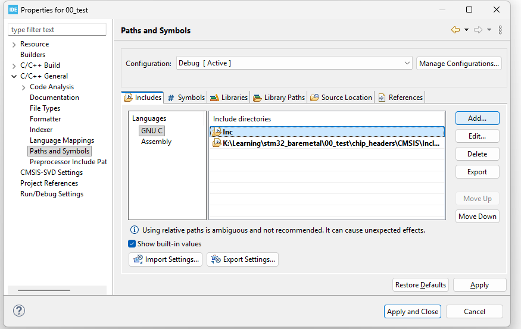

The screenshot shows the list **after** the first path is added; repeat **Add…** until **both** directories above are present.

---

## Part D — `stm32h7xx.h`, build error, and **`STM32H723xx`** (no extra figures yet)

These steps are required for a clean build; add screenshots later if you want figures for them.

1. In **`main.c`**, add:

   ```c
   #include "stm32h7xx.h"
   ```

2. **Build** the project (**Project → Build Project**). You may see:

   > **Please select first the target STM32H7xx device used in your application (in stm32h7xx.h file)**

3. Fix it by defining the part for the **C compiler** (recommended):  
   **Properties** → **C/C++ Build** → **Settings** → **MCU GCC Compiler** → **Preprocessor** → **Defined symbols (-D)** → add **`STM32H723xx`**.  
   (Alternatively, uncomment **`#define STM32H723xx`** in **`stm32h7xx.h`** — less friendly to upgrades.)

4. **Build** again; you want **0 errors** in the **Console**.

**Useful extra screenshots (optional):** `main.c` with the include, **Problems** / **Console** with the error, **Preprocessor** page showing **`STM32H723xx`**, and a successful **Build Finished** line.

---

## Chapter checklist

- [ ] STM32CubeH7 downloaded from **st.com** and extracted.  
- [ ] **`chip_headers`** contains **`Include`** and **`Device`** (from **`Drivers\CMSIS`**), **`STM32H7xx`** trimmed to **Include** + **Source** as needed.  
- [ ] **`chip_headers`** copied under **`00_test`**.  
- [ ] **Paths and Symbols** lists **two** absolute (or consistent workspace-relative) include paths that match your **actual** folder layout.  
- [ ] **`#include "stm32h7xx.h"`** in **`main.c`**, **`STM32H723xx`** defined, build succeeds.

---

## Next

With headers and **`STM32H723xx`** in place, you can use CMSIS register names in bare-metal code.

**Course index:** [README.md](README.md)
